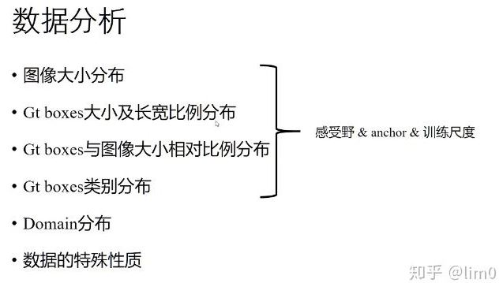
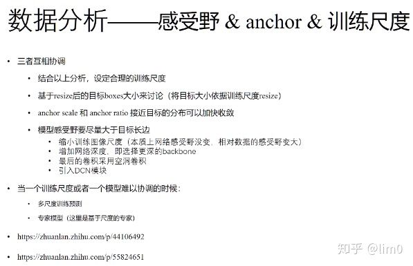
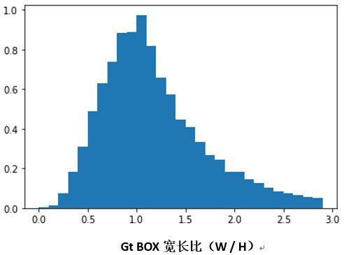
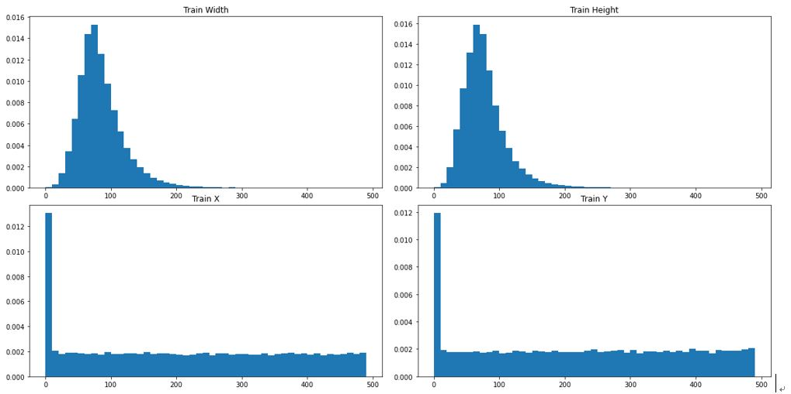
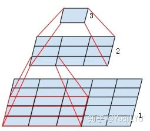
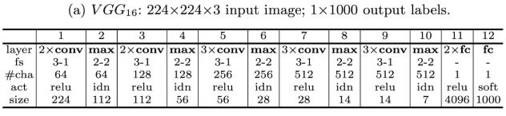
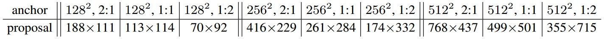
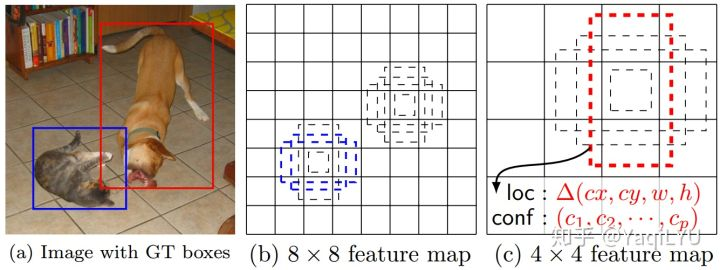
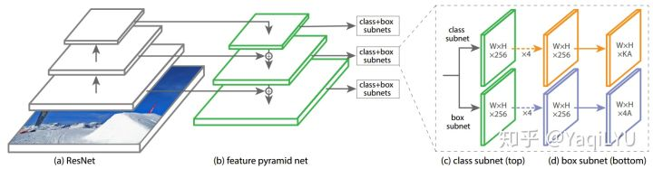
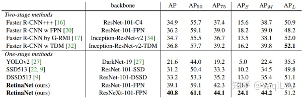

[TOC]

# 数据分析教程



- **图像大小分布**：
- 医疗、遥感常见超大图像，需要合理的crop操作
- 数据集内图像大小差异较大，需要合理padding和crop
- 结合自身设备初步判断训练尺度上限


- **Gt boxes大小及长宽比例分布**
- Boxes大小影响anchor scale设计
- Boxes长宽比例分布影响anchor ratio设计（极端的长宽比一般需要自己调整比例）
- 类内和类间boxes大小分布，多尺度或者专家模型（比如一类极端的小，一类极端的大，这样的话对于模型的感受野的考虑就很难权衡）


- **Gt boxes与图像大小相对比例分布**
- 通过这个比例可以计算目标在经过resize进入网络时候的实际大小，从而得以：
- 结合图像实际大小决定训练尺度选取：个人理解如果本来目标相对原图就小，再用小尺度那就不合适，如果本来目标比较大，那么或许可以采取小的训练尺度
- 决定anchor scale
- 决定anchor ratio
- 决定backbone的选取（模型感受野）：不同backbone不同大小的感受野，越深的模型感受野越大。但是太大的感受野对于小目标的检测肯定是不好
- 大，中，小三种目标的权重


- **数据分析---gt boxes类别比例分布（长尾分布）**
- 上采样增强：对于少的类
- 下采样增强：数量多的类
- 训练动态加权采样：比如使得每一个batch里面选的数量少的类的概率更大
- 专家模型：对于极端少的类别



> 可以参考的数据分析链接：
>
> https://zhuanlan.zhihu.com/p/44106492
>
> https://zhuanlan.zhihu.com/p/55824651


# WHEAT 数据分析

## 图像数量

train有3422张

## 图像大小分布

均为==1024*1024==，不存在超大图像，不需要crop或pad，应该也没到训练尺度上限

## **Gt boxes大小及长宽比例分布**

- W、H满足正态分布，均值为84、77
  - Boxes大小影响anchor scale设计
- W / H 宽长比的均值为： 1.27
  - Boxes长宽比例分布影响anchor ratio设计（极端的长宽比一般需要自己调整比例）
  - 

## 数据难点

1. 谷物single head很密集
2. 风吹过会模糊图像

## BBOX分析

**train.csv中bbox分析，**

**X、Y、W、H 的均值：**

**472 、475、84、77**




## **Gt boxes与图像大小相对比例分布**

GT BOX与图像大小均值比例大约在**0.07**，属于小目标

- 通过这个比例可以计算目标在经过resize进入网络时候的实际大小，从而得以：
- 结合图像实际大小决定训练尺度选取：个人理解如果本来目标相对原图就小，再用小尺度那就不合适，如果本来目标比较大，那么或许可以采取小的训练尺度
- 决定anchor scale
- 决定anchor ratio
- 决定backbone的选取（模型感受野）：不同backbone不同大小的感受野，越深的模型感受野越大。但是太大的感受野对于小目标的检测肯定是不好
- 大，中，小三种目标的权重

# 预测目标

预测图片中的每一个wheat head

# 卷积神经网络的感受野

 RPN(region proposal network)，锚框(anchor)是RPN的基础，感受野(receptive field, RF)是anchor的基础 。 本文介绍感受野及其计算方法，和有效感受野概念。 

## **感受野**

在典型CNN结构中，FC层每个输出节点的值都依赖FC层所有输入，而CONV层每个输出节点的值仅依赖CONV层输入的一个区域，这个区域之外的其他输入值都不会影响输出值，该区域就是感受野。



 **某一层feature map(**特性图**)中某个位置的特征向量，是由前面某一层固定区域的输入计算出来的，那这个区域就是这个位置的感受野**。任意两个层之间都有位置—感受野对应关系，但我们更常用的是feature map层到输入图像的感受野，如目标检测中我们需要知道feature map层每个位置的特征向量对应输入图像哪个区域，以便我们在这个区域中设置anchor，检测该区域内的目标。 

 **感受野区域之外图像区域的像素不会影响feature map层的特征向量** 

感受野有什么用呢？

- 一般task要求感受野越大越好，如**图像分类中最后卷积层的感受野要大于输入图像**，网络深度越深感受野越大性能越好
- 密集预测task要求输出像素的感受野足够的大，确保做出决策时没有忽略重要信息，一般也是越深越好
- 目标检测task中设置anchor要严格对应感受野，anchor太大或偏离感受野都会严重影响检测性能

==**一个多层卷积构成的FCN感受野等于一个conv rxr，即一个卷积核很大的单层卷积，其kernelsize=r，padding=P，stride=S**==

## 感受野的计算

 **一个多层卷积构成的FCN感受野等于一个conv r*r，即一个卷积核很大的单层卷积，其kernelsize=r，padding=P，stride=S**。 

==**注意下面是从后往前计算的！！！（网络反过来）**==

- 初始feature map层的感受野是1
- 每经过一个convk*k s1的卷积层，感受野 r = r + (k - 1)，**常用k=3感受野 r = r + 2, k=5感受野r = r + 4**
- 每经过一个convk*k s2的卷积层或max/avg pooling层，感受野 r = (r * 2) + (k -2)，常用卷积核k=3, s=2，感受野 r = r * 2 + 1，卷积核k=7, s=2, 感受野r = r * 2 + 5
- 每经过一个maxpool2*2 s2的max/avg pooling下采样层，感受野 r = r * 2
- 特殊情况，经过conv1*1 s1不会改变感受野，**经过FC层和GAP层，感受野就是整个输入图像**
- 经过多分枝的路径，按照感受野最大支路计算，shotcut也一样所以不会改变感受野
- ReLU, BN，dropout等元素级操作不会影响感受野
- **全局步进等于经过所有层的步进累乘**，$S=s_{-1}*s_{-2}*s_{-3}...*s_{1}$
- 经过的所有层所加padding都可以等效加在输入图像，等效值P，直接用卷积的输入输出公式 $f_{out}=(f_{in}-r+2P)/S+1$ 反推出P即可

VGG16如下所示：



SSD的 backbone是**VGG-16**，如下 ：


  先来计算SSD中第一个feature map输出层的感受野， 结构是conv4-3 backbone + conv3x3 classifier ：

> RPN结构：conv3x3 + 2个并列conv1x1 

$$
r = 1 +2 +2\times3 )\times2 +2\times3 )\times2 +2\times2 )\times2 +2\times2 = 108\\
S = 2\times2\times2 = 8  \\
P = floor(r/2 - 0.5) = 53\\
$$

 以上结果表示感受野的分布方式是：在paddding=53(*上下左右都加*) 的输入224x224图像上，大小为108x108的正方形感受野区域以stride=8平铺。 

>**Conv7：**指的是第七个卷积层 。 **SSD使用的是VGG16做特征提取**，原版的VGG16包含五个卷积block和三个全连接层。但是SSD将VGG16的全连接层改成了卷积层，Conv7在VGG16里面对应的是第二个全连接层。
>
>**Conv5_3：**VGG每个卷积block包含2个或3个卷积层，所以Conv5的意思是第五个卷积block，**Conv5_3指的是第五个卷积block里面的第三个卷积层。**

# 目标检测中的Anchor

 首先预设一组不同尺度不同位置的固定参考框，覆盖几乎所有位置和尺度，每个参考框负责检测与其交并比大于阈值 (*训练预设值，常用0.5或0.7*) 的目标，anchor技术将问题转换为**"这个固定参考框中有没有认识的目标，目标框偏离参考框多远"**，不再需要多尺度遍历滑窗，真正实现了又好又快，如在Faster R-CNN和SSD两大主流目标检测框架及扩展算法中anchor都是重要部分。 

 **设置**：RPN用stride 16的单feature map进行预测，anchor为三尺度{128, 256, 512}三比例{1:1, 1:2, 2:1}，feature map上每个位置设置9个参考anchor，这些大约能覆盖边长70~768的目标。下图是Faster R-CNN论文中个anchor形状训练后学习到的平均proposal大小。 



**感受野**：典型1000x600输入图像，经过conv5-3 + RPN，用于预测的feature map层分辨率是63x38，计算这一层的感受野：

```python3
r = 1 + 2 + 2x3 )x2 + 2x3 )x2 + 2x3 )x2 + 2x2 )x2 + 2x2 = 228 < 512
```

Anchor设置方面有三个问题（*从今天的算法水平往回看，事后诸葛角度*）：

1. 最小的anchor是128x128尺度，而COCO小目标很多，且小目标很小，远小于这个尺度，为了能检测这些小目标，Faster R-CNN不得不放大输入图像(~1000x600)，**导致**计算速度成倍增加，而同时被放大的大目标可能超过最大anchor尺度，又不得不加入多尺度测试保证从大到小anchor全覆盖，进一步影响速度；
2. 最大的anchor是512x512尺度，而预测层的感受野仅228，上一篇讨论过，==**一般来说感受野一定要大于anchor大小，而且越大越好，这里感受野明显不足以支撑最大尺度的anchor，导致大尺度目标检测性能不够好；**==
3. 三尺度按照检测目标的大小，我们简称为大、中、小锚框，那么三个尺度的anchor分别有63x38x3=**7182**个，共计7182x3=**21546**个anchor。通常anchor需要覆盖训练集的所有目标，即每个groundtruth box都能匹配到一个anchor，因此理想情况下目标越小anchor应该越多越密集，才能覆盖所有的候选区域，目标越大anchor应该越少越稀疏，否则互相高度重叠造成冗余计算量，反观RPN这里的单一feature map三尺度三比例设置，**导致**检测小目标的anchor太少太疏，而检测大目标的anchor太多太密。论文提到Faster R-CNN训练中忽略了所有跨边界的anchor否则训练无法收敛，尺度越大跨边界越多，所以训练中忽略掉的很多都是大锚框。

## SSD中的Anchor


SSD是VGG16+conv3x3进行检测，输出目标分类和边框回归结果，从6个stride递增的feature map进行预测，网络结构从conv7之前是标准的VGG16结构，之后每一组conv1x1 + conv3x3s2输出一个stride的feature map。

**设置**：feature map从stride8开始共6层，每层4或6个形状的anchor，anchor共6个尺度(0.2~0.9)x300，6个形状是{1, 2, 3, 1/2, 1/3}比例框，外加较大的{1}比例框，依然按照大、中、小锚框进行划分，典型300x300输入图像：

- **小锚框：**从{conv4_3} feature map检测单一小尺度{60}目标，4个anchor形状，共38x38x4=**5776**个anchor；
- **中锚框：**从{conv7, conv8_2, conv9_2} feature map检测三个中尺度{102, 144, 186}目标，6形状anchor，共19x19x6 + 10x10x6 + 5x5x6=**2916**个anchor；
- **大锚框：**从{conv10_2, conv11_2}检测两个大尺度{228, 270}目标，4形状anchor，共3x3x4 + 1x1x4=**40**个anchor；



**感受野**：计算conv4-3+conv3x3 ~ conv11_2+conv3x3的感受野

```text
r1 = 1 + 2 + 2x3 )x2 + 2x3 )x2 + 2x2 )x2 + 2x2 = 108 > 60
r2 = 1 + 2 + 2 + 2x3 )x2 + 2x3 )x2 + 2x3 )x2 + 2x2 )x2 + 2x2 = 260 > 102
r3 = 1 + 2 )x2+1 + 2 + 2x3 )x2 + 2x3 )x2 + 2x3 )x2 + 2x2 )x2 + 2x2 = 324 > 144
r3 = 1 + 2 )x2+1 )x2+1 + 2 + 2x3 )x2 + 2x3 )x2 + 2x3 )x2 + 2x2 )x2 + 2x2 = 452 > 186
...
```

可以看到各层的感受野都是大于anchor大小的。

**分析**：6个feature map共计5776 + 2916 + 40=**8732**个anchor，总数量比RPN少了很多，而且小尺度锚框多且密，大尺度锚框少且疏，更合理；anchor的尺度范围从60到284，输入图像不用故意放大去检测小目标，计算速度更快；大尺度分布合理，不忽略跨边界anchor训练结果更好。

Anchor设置方面有三个问题（*继续马后炮角度*）：

1. 论文中提到的anchor设置没有**对齐感受野**，通常几个像素的中心位置偏移，对大目标来说IOU变化不会很大，但对小目标IOU变化剧烈，尤其感受野不够大的时候，anchor很可能偏移出感受野区域，影响性能。
2.  还是论文中提到的，anchor尺度和比例都是人工给定的，**尺度和比例必须要覆盖相应任务的可能出现的所有目标**，如PASCAL VOC评价每图目标数较少、目标较大，所以SSD中最小60x60的anchor或许够用，但MS COCO中目标密集且小、数量多，对anchor的密度和最小尺度都有严格要求，60x60的最小框完全不够看，只能放大输入图像。 

一种方法是针对特定数据集设计anchor，如YOLOv2中的聚类，和近期有论文CNN训练anchor的设置，这些方法或许更适合某一数据集，但也可能影响模型的泛化能力，换一个库是否依然够用。另一种方法就是多尺度测试，尺度不够，缩放来凑，常用multi-test，和SNIP等等方法，都牺牲了速度，实用性打折。

3. **深度悖论**(*杜撰*)：SSD检测**小目标**是从conv4-3拉出来的，共经过11个conv3x3，检测**中目标**是从{conv7, conv8_2, conv9_2}拉出来的，分别经过{15, 16, 17}个conv3*3，检测大目标经过的卷积层就更多了，一般经过的conv3x3越多，深度越深，感受野越大，特征越强 (*这一说法有否正确？*)。

一般来说，目标越小，像素数量少，清晰度低，细节丢失严重，检测难度越大，反之目标越大，检测难度越小。RPN框架检测各尺度的特征深度相同，但SSD框架目标越小越难的，特征深度反而越浅，特征越弱。

4. 继续来看最小anchor不够小的问题：我们能否将stride4的feature map拉出来，设置更小anchor检测比60更小的目标呢？实际操作当然可行，**我们将conv3_3的feature map上加一个检测头，假设anchor设置为{30}，计算这一层感受野，看看能支持多小目标：**

```text
r0 = 1 + 2 + 2x3 )x2 + 2x2 )x2 + 2x2 =  48 > 30
```

直观来看==**conv3_3可以支持这一anchor，但小目标更需要大感受野来提供上下文信息，如果感受野太小误检率会非常高。**==

## **FPN中的Anchor**



**设置**：FPN + ResNet标配后，Faster R-CNN和SSD分别进化为Faster R-CNN+FPN/Mask R-CNN（简写FPN）和RetinaNet，Pn表示对应feature map的stride是 ![[公式]](https://www.zhihu.com/equation?tex=2%5E%7Bn%7D) ，尺度都是 {32, 64, 128, 256, 512}：不同点是：

- FPN从 {P2, P3, P4, P5, P6} 拉出5个feature map进行检测，每个位置预测三比例，不同尺度不同形状的anchor共15个
- RetinaNet从 {P3, P4, P5, P6, P7} 拉出5个feature map进行检测，每个位置预测三尺度三比例，每个尺度预测9个形状anchor

**感受野**：首先忽略FPN的top-down pathway，考虑RPN中的conv3x3卷积层，直接计算ResNet-50各个feature map的感受野，{P2, P3, P4, P5}分别对应{conv2_3, conv3_4, conv4_6, conv5_3}：

```text
P2 = 1 +2 +2x3 )x2+1 )x2+5 = 43
P3 = 1 +2 +2x3 )x2+1 +2x3 )x2+1 )x2+5 = 107
P4 = 1 +2 +2x5 )x2+1 +2x3 )x2+1 +2x3 )x2+1 )x2+5 = 299
P5 = 1 +2 +2x2 )x2+1 +2x5 )x2+1 +2x3 )x2+1 +2x3 )x2+1 )x2+5 = 491
```

随着block增加，感受野也对应越多，如果考虑检测需要上下文，stride32的感受野足够大，但stride4的感受野不够大。FPN中的bottom-up pathway将深度层特征上采样后与当前层相加，相加时感受野取最大，即相加后感受野等于深度层的感受野，FPN仅用微小计算量，实现了浅层feature map的感受野大幅提升，高效解决了“深度悖论”，目前是目标检测的标配。

**分析**：同样尺度为32的anchor，FPN用P2进行检测，而RetinaNet用P3进行检测，这是因为FPN的前景阈值是0.7需要anchor更密集，RetinaNet前景阈值是0.5 anchor相对稀疏，FPN技术继承了前面SSD的所有优点，还以极低计算量克服了浅层感受野不足的问题。

Anchor设置方面的问题（*这么完美还有问题? 后面全是瞎说*）：

1. 小框的问题：MS COCO上数据库上小目标的AP(S)远低于大目标的AP(L)，如下表，从anchor角度来看可能是两方面的问题：

- 来自高层的feature map上采样用了最简单的最近邻插值，太过于粗糙，而且高层特征训练用于检测大目标，可能已经丢失了小目标相关的语义
- 低层自己的feature map感受野本来比较小，缺乏上下文信息



**实验**：某直筒型检测网络，用stride4的feature map层设置16x16的anchor检测小目标，为了提高小目标的检测性能，采用两种不同方法增加感受野

- stride4加深度(加2个conv3x3卷积层)
- 加入FPN技术，用P2层进行检测

实现发现第一种方法对小目标检测的提升更大，但第一种方法由于分辨率较大引入了很多额外计算量，模型大小和训练所需内测都大幅上升，相反第二种方法额外计算量非常少，在速度方面优势非常大。

\2. 大框的问题：用大stride层的feature map检测大目标，步进等于stride，anchor数量少且疏，造成边框回归的难度增加，而且感官上更容易看到大目标的检测偏差。

为了提高高层feature map的分辨率，近期很多论文都在stride16之后用空洞卷积代替下采样block，在提高感受野的同时保持空间分辨率不下降，以获得更密集的大目标anchor，提升大目标的检测性能。空洞卷积的理论计算量与标准卷积相同但更难优化，如果采用空洞卷积则通道数不用翻倍，否则速度无法接受。

## **Anchor设计总结**

总结以上几篇论文，设计目标检测算法时，anchor设置应该考虑一下几个方面 (*以RetinaNet为例*)：

1. anchor的密度：由检测所用feature map的stride决定，这个值与前景阈值密切相关，如同样检测{32}尺度，FPN阈值0.7用P2，RetinaNet前景阈值0.5用P3。
2. anchor的范围：RetinaNet中是anchor范围是32~512，这里应根据任务检测目标的范围确定，按需调整anchor范围，或目标变化范围太大如MS COCO，这时候应采用多尺度测试，当然，实际应用中需考虑多尺度测试的复杂度问题。
3. anchor的形状数量：RetinaNet每个位置预测三尺度三比例共9个形状的anchor，这样可以增加anchor的密度，但stride决定这些形状都是同样的滑窗步进，需考虑步进会不会太大，如RetinaNet框架前景阈值是0.5时，一般anchor大小是stride的4倍左右。
4. 检测层Pn的数量：RetinaNet中是P3~P7共5个检测层，如需检测更小的目标，可以考虑加入P2检测层。
5. 检测层Pn的感受野：前面计算了RetinaNet中是ResNet+FPN的感受野在检测中、大目标时都是够用的，检测小目标时略显疲乏，kaiming最新论文《Rethinking ImageNet Pre-training》既然告诉我们预训练模型没那么重要时，那检测任务就可以着重考虑按照感受野的需求设计ConvNet。

总之，要做到anchor以足够密度实现全覆盖。